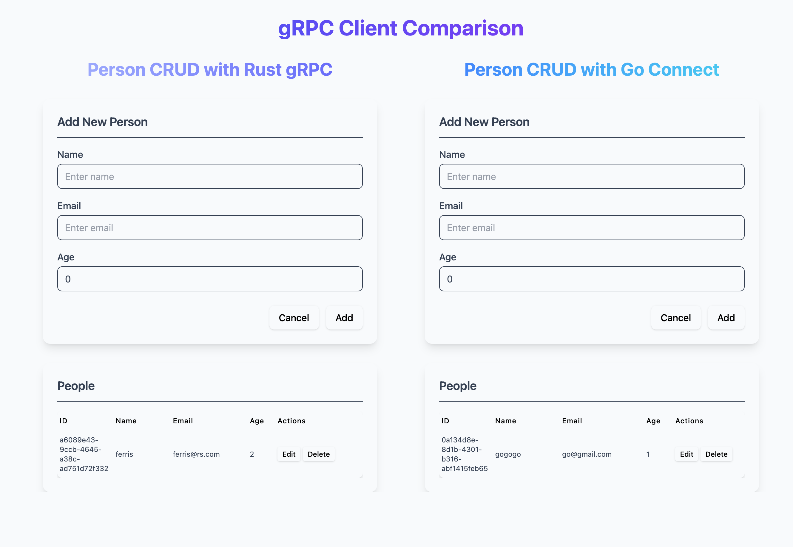

# Person CRUD gRPC Application

This is a full-stack application with a React TypeScript frontend using Vite, a Rust gRPC backend, and a Go connect backend.



## Project Structure

- `/frontend`: React TypeScript frontend built with Vite
- `/rust-grpc-backend`: Rust backend with gRPC
- `/go-connect-backend`: Go backend with connect
- `/proto`: Protocol buffer definitions shared between frontend and backend

## Prerequisites

- Node.js
- Rust and Cargo
- Go (for the Go backend)
- Docker (for running Envoy)
- [Protobuf Compiler](https://grpc.io/docs/protoc-installation/) (protoc) - Optional, because @bufbuild/buf is used for generating code in the repo

## Setup Instructions

```bash
# Run frontend
cd frontend
yarn install
yarn gen-proto # Generate TypeScript code from proto files
yarn dev # Start the frontend server


# Run rust grpc server
cd rust-grpc-backend
cargo run

# Run envoy
docker-compose up

# Install Go tools for building and generating connect code (installed globally)
go install github.com/bufbuild/buf/cmd/buf@latest
go install github.com/fullstorydev/grpcurl/cmd/grpcurl@latest
go install google.golang.org/protobuf/cmd/protoc-gen-go@latest
go install connectrpc.com/connect/cmd/protoc-gen-connect-go@latest

# Run go connect server
cd go-connect-backend
buf generate # Generate Go code from proto files
go run .
```

Open your browser and navigate to [http://localhost:3000](http://localhost:3000)

## Features

- Create, Read, Update, Delete operations for people
- Type-safe communication between frontend and backend using gRPC/connect
- Real-time data updates

## Technologies Used

- **Frontend**:

  - React with TypeScript
  - Vite for fast development
  - Buf for compiling protocol buffers
  - Connect for communication

- **Rust gRPC Backend**:

  - Rust
  - Tonic for gRPC implementation
  - In-memory storage (can be extended to use a database)

- **Go Connect Backend**:

  - Go
  - Buf for compiling protocol buffers
  - Connect for gRPC implementation
  - In-memory storage (can be extended to use a database)

- **Shared**:
  - Protocol Buffers for type definitions
